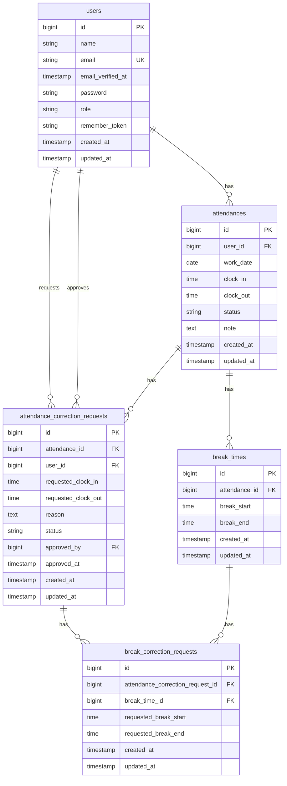

# 勤怠管理アプリ

---
## 環境構築

### Dockerビルド

```bash
git clone https://github.com/kajihata-rumi/coachtech-attendance.git
cd coachtech-attendance
docker-compose up -d --build
```
### Laravel環境構築

```bash
docker-compose exec php bash
composer install
cp .env.example .env
```

`.env`を設定後、以下を実行してください。
```bash
php artisan key:generate
php artisan migrate --seed
```
---

## .env設定

`.env.example`を`.env`にコピーした後、以下を設定してください。
`DB_HOST=127.0.0.1`のままだとDocker環境で接続できません。

```env
DB_CONNECTION=mysql
DB_HOST=mysql
DB_PORT=3306
DB_DATABASE=attendance_db
DB_USERNAME=laravel_user
DB_PASSWORD=laravel_pass

MAIL_MAILER=smtp
MAIL_HOST=mailhog
MAIL_PORT=1025
MAIL_USERNAME=null
MAIL_PASSWORD=null
MAIL_ENCRYPTION=null
MAIL_FROM_ADDRESS=no-reply@example.com
MAIL_FROM_NAME="${APP_NAME}"

APP_URL=http://localhost
```
---

## 使用技術

- PHP 8.1.34
- Laravel 8.83.29
- MySQL 8.0.46
- nginx 1.21.1
- Docker 29.4.1
- Docker Compose v5.1.3
- MailHog
- Laravel Fortify

---

## URL一覧

- 開発環境 = http://localhost/
- phpMyAdmin = http://localhost:8080
- MailHog = http://localhost:8025

---

## テスト用アカウント
Seederで初期データを登録しています。

- 管理者
    - email = `admin@example.com`
    - password = `.password`

- 一般ユーザー（スタッフ）
    - 'name' => `西 伶奈`
    - 'email' => `reina.n@coachtech.com`
    - password = `.password`

    - 'name' => `山田 太郎`
    - 'email' => `taro.y@coachtech.com`
    - password = `.password`

    - 'name' => `増田 一世`
    - 'email' => `issei.m.n@coachtech.com`
    - password = `.password`

    - 'name' => `山本 敬吉`
    - 'email' => `rkeikichi.y@coachtech.com`
    - password = `.password`

    - 'name' => `秋田 朋美`
    - 'email' => `tomomi.a@coachtech.com`
    - password = `.password`

    - 'name' => `中西 教夫`
    - 'email' => `norio.n@coachtech.com`
    - password = `.password`

---
## ER図
以下はMermaid記法で記載しています。
GitHub上ではER図として自動表示されます。


### ER図補足

- `users.role` により、一般ユーザーと管理者を判別します。
- `attendances` は `user_id` と `work_date` の組み合わせをユニークにしています。
- `attendance_correction_requests.status` は申請状態を管理します。
- `attendance_correction_requests.approved_by` は承認した管理者ユーザーを参照します。
- `break_correction_requests.break_time_id` は既存休憩の修正時に使用し、新規休憩申請ではNULLを許容します。

---
## 機能一覧

- 一般ユーザー
    - 会員登録
    - ログイン
    - 勤怠打刻（出勤・休憩・退勤）
    - 勤怠確認（一覧・詳細）
    - 修正申請
    - 状況確認（承認待ち・承認済み）

- 管理者
    - 管理者ログイン
    - 一般ユーザー（スタッフ）全員分の日時勤怠一覧表示
    - 勤怠詳細確認（直接修正）
    - 一般ユーザー（スタッフ）全員分の一覧表示
    - 一般ユーザー（スタッフ）毎の月次勤怠一覧表示・CSV出力
    - 修正申請一覧表示（状況確認）
    - 修正申請承認（詳細・承認作業）

---
## 補足事項

